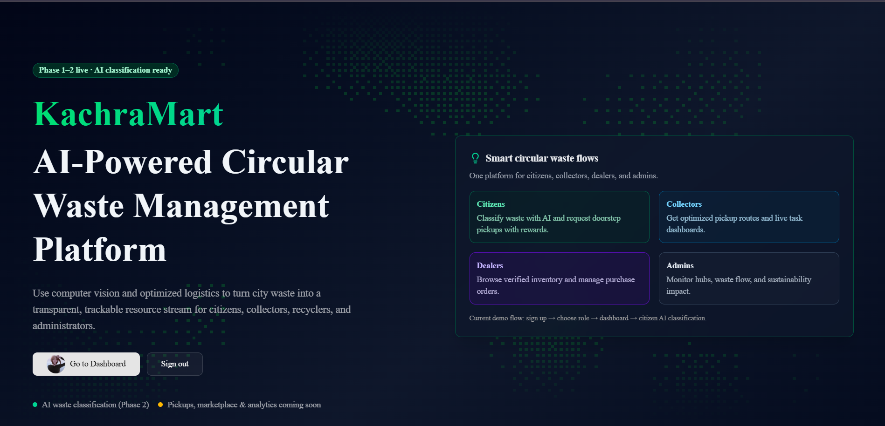

📍 **IMPORTANT:** The old deployment URL is unavailable. Use the new one: https://kachra-mart-india-innovates2026.vercel.app/



# ♻️ KachraMart - Circular Waste Management Platform

> **Transform city waste into a transparent, trackable resource stream**

A comprehensive waste management platform powered by AI, connecting citizens, collectors, recyclers, and administrators in a circular economy ecosystem.

---

## 📋 Table of Contents

- [Project Overview](#project-overview)
- [Current Progress](#current-progress)
- [Technology Stack](#technology-stack)
- [Features](#features)
- [Getting Started](#getting-started)
- [Project Structure](#project-structure)
- [Roadmap](#roadmap)
- [Contributing](#contributing)

---

## 🎯 Project Overview

**KachraMart** is an innovative platform designed to revolutionize waste management in India by creating a transparent, AI-powered circular economy. The platform connects four key stakeholders:

### 👥 User Roles

| Role | Purpose | Features |
|------|---------|----------|
| **Citizen** | Waste generators | Upload waste images, request pickups, earn rewards |
| **Collector** | Pickup services | Receive assignments, optimize routes, track deliveries |
| **Dealer** | Recyclers/Buyers | Browse inventory, place orders, manage purchases |
| **Admin** | Platform managers | Monitor analytics, manage hubs, track impact |

---

## 📊 Current Progress

### ✅ Phase 1: Project Setup & Authentication (COMPLETE)

**Status:** 100% Complete

**Achievements:**
- ✅ Next.js 15 with TypeScript setup
- ✅ MongoDB database with Mongoose ODM
- ✅ NextAuth.js v5 authentication system
- ✅ Google OAuth integration
- ✅ Email/Password authentication with JWT
- ✅ Role-based access control
- ✅ Protected routes and components
- ✅ User profile management
- ✅ Responsive UI with Tailwind CSS & shadcn/ui

**Key Files:**
- `lib/auth.ts` - Authentication configuration
- `models/User.ts` - User database model
- `app/api/auth/[...nextauth]/route.ts` - Auth endpoints
- `components/auth/` - Auth components

---

### ✅ Phase 2: AI Waste Detection (COMPLETE)

**Status:** 100% Complete

**Achievements:**
- ✅ Roboflow AI integration for waste detection
- ✅ Cloudinary image upload and management
- ✅ Multi-item waste detection
- ✅ Automatic waste categorization
- ✅ Confidence scoring system
- ✅ Image preview and validation
- ✅ Drag & drop upload interface
- ✅ Classification results display
- ✅ Bounding box visualization

**Supported Waste Types:**
- 🟢 **Biodegradable** - Food waste, fruit peels
- 🔵 **Recyclable** - Plastic, metal, cardboard, paper
- 🔴 **Hazardous** - Batteries, chemicals
- ⚡ **E-waste** - Electronics, circuit boards
- 🟣 **Construction** - Bricks, concrete

**Key Files:**
- `lib/roboflow.ts` - Roboflow API integration
- `lib/cloudinary.ts` - Cloudinary configuration
- `app/api/upload/route.ts` - Image upload endpoint
- `app/api/classify/route.ts` - Classification endpoint
- `components/citizen/ImageUpload.tsx` - Upload component
- `components/citizen/ClassificationResult.tsx` - Results display

---

### 🚀 Phase 3: Waste Listing & Pickup (IN PROGRESS)

**Status:** Foundation Ready

**Planned Features:**
- Waste listing creation from AI results
- Location-based pickup requests
- Collector assignment system
- Route optimization
- Real-time status tracking
- Pickup confirmation workflow

---

### 📅 Future Phases

| Phase | Focus | Status |
|-------|-------|--------|
| **Phase 4** | Waste Hub & Inventory | Planned |
| **Phase 5** | Recycler Marketplace | Planned |
| **Phase 6** | Admin Analytics | Planned |

---

## 🛠️ Technology Stack

### Frontend
- **Framework:** Next.js 15 with App Router
- **Language:** TypeScript
- **Styling:** Tailwind CSS v4
- **UI Components:** shadcn/ui
- **Icons:** Lucide React
- **Animations:** Framer Motion
- **State Management:** React Hooks + NextAuth.js

### Backend
- **Runtime:** Node.js
- **API:** Next.js API Routes
- **Authentication:** NextAuth.js v5
- **Database:** MongoDB with Mongoose
- **Image Storage:** Cloudinary
- **AI/ML:** Roboflow Custom Workflow

### DevOps & Tools
- **Package Manager:** npm
- **Linting:** ESLint
- **Version Control:** Git
- **Environment:** Node.js 18+

---

## ✨ Features

### 🔐 Authentication & Security
- Email/Password registration and login
- Google OAuth integration
- JWT-based sessions (30-day expiry)
- Password hashing with bcrypt
- Email validation
- Phone number validation
- Protected routes with role-based access

### 🤖 AI Waste Classification
- Real-time waste detection using Roboflow
- Multi-item detection in single image
- Automatic waste categorization
- Confidence scoring (0-100%)
- Bounding box visualization
- Classification history

### 👤 User Profile Management
- Editable profile information
- Profile picture upload
- Phone number management
- Role-based color coding
- Account verification status
- User avatar with initials fallback

### 📱 Responsive Design
- Mobile-first approach
- Adaptive layouts
- Touch-friendly UI
- Cross-browser compatibility
- Optimized performance

### 🎨 User Experience
- Smooth animations and transitions
- Loading states and indicators
- Error handling and messages
- Drag & drop interfaces
- Real-time feedback
- Intuitive navigation

---

## 🚀 Getting Started

### Prerequisites
- Node.js 18+ and npm
- MongoDB instance (local or cloud)
- Cloudinary account
- Roboflow API key
- NextAuth.js configuration

### Installation

1. **Clone the repository**
   ```bash
   git clone https://github.com/yourusername/kachramart.git
   cd kachramart
   ```

2. **Install dependencies**
   ```bash
   npm install
   ```

3. **Configure environment variables**
   ```bash
   cp .env.example .env.local
   ```
   
   Update `.env.local` with:
   ```env
   # Database
   MONGODB_URI=your_mongodb_connection_string
   
   # NextAuth
   NEXTAUTH_URL=http://localhost:3000
   NEXTAUTH_SECRET=your_secret_key
   
   # Google OAuth (optional)
   GOOGLE_CLIENT_ID=your_google_client_id
   GOOGLE_CLIENT_SECRET=your_google_client_secret
   
   # Cloudinary
   NEXT_PUBLIC_CLOUDINARY_CLOUD_NAME=your_cloud_name
   CLOUDINARY_API_KEY=your_api_key
   CLOUDINARY_API_SECRET=your_api_secret
   
   # Roboflow
   ROBOFLOW_API_KEY=your_roboflow_api_key
   ```

4. **Run the development server**
   ```bash
   npm run dev
   ```

5. **Open in browser**
   ```
   http://localhost:3000
   ```

### Testing the Platform

**Test Account (Citizen):**
- Email: `citizen@test.com`
- Password: `password123`

**Test Account (Collector):**
- Email: `collector@test.com`
- Password: `password123`

**Test Account (Dealer):**
- Email: `dealer@test.com`
- Password: `password123`

---

## 📁 Project Structure

```
kachramart/
├── app/                          # Next.js app directory
│   ├── (authenticated)/          # Protected routes
│   │   ├── dashboard/            # User dashboard
│   │   ├── citizen/              # Citizen features
│   │   │   └── classify/         # AI classification
│   │   ├── collector/            # Collector features
│   │   ├── dealer/               # Dealer features
│   │   ├── admin/                # Admin features
│   │   └── api/                  # Protected API routes
│   ├── auth/                     # Authentication pages
│   │   ├── signin/               # Sign in page
│   │   └── signup/               # Sign up page
│   ├── api/                      # Public API routes
│   │   └── auth/                 # Auth endpoints
│   ├── layout.tsx                # Root layout
│   ├── page.tsx                  # Landing page
│   └── globals.css               # Global styles
│
├── components/                   # React components
│   ├── auth/                     # Auth components
│   ├── citizen/                  # Citizen components
│   ├── collector/                # Collector components
│   ├── dealer/                   # Dealer components
│   ├── admin/                    # Admin components
│   ├── shared/                   # Shared components
│   └── ui/                       # UI components (shadcn/ui)
│
├── lib/                          # Utility functions
│   ├── auth.ts                   # Auth configuration
│   ├── roboflow.ts               # Roboflow integration
│   ├── cloudinary.ts             # Cloudinary integration
│   ├── theme.ts                  # Theme configuration
│   ├── utils.ts                  # Utility functions
│   └── db/                       # Database utilities
│
├── models/                       # Database models
│   ├── User.ts                   # User model
│   └── WasteListing.ts           # Waste listing model
│
├── hooks/                        # Custom React hooks
│   ├── useAuth.ts                # Auth hook
│   └── use-mobile.ts             # Mobile detection
│
├── types/                        # TypeScript types
│   ├── index.ts                  # Main types
│   └── next-auth.d.ts            # NextAuth types
│
├── config/                       # Configuration
│   └── constants.ts              # App constants
│
├── public/                       # Static assets
│   └── ...                       # Images, icons, etc.
│
├── .env.example                  # Environment template
├── .env.local                    # Environment variables
├── next.config.ts                # Next.js config
├── tsconfig.json                 # TypeScript config
├── tailwind.config.ts            # Tailwind config
├── package.json                  # Dependencies
└── README.md                     # This file
```

---

## 🗺️ Roadmap

### Phase 3: Waste Listing & Pickup (Q1 2026)
- [ ] Waste listing creation
- [ ] Location-based requests
- [ ] Collector assignment
- [ ] Route optimization
- [ ] Status tracking
- [ ] Pickup confirmation

### Phase 4: Waste Hub & Inventory (Q2 2026)
- [ ] Hub management
- [ ] Inventory tracking
- [ ] Waste verification
- [ ] Storage optimization
- [ ] Hub analytics

### Phase 5: Recycler Marketplace (Q3 2026)
- [ ] Dealer marketplace
- [ ] Inventory browsing
- [ ] Purchase requests
- [ ] Bidding system
- [ ] Order management
- [ ] Transaction history

### Phase 6: Admin Analytics (Q4 2026)
- [ ] Waste flow dashboard
- [ ] Recycling statistics
- [ ] Environmental impact metrics
- [ ] User management
- [ ] System monitoring
- [ ] Report generation

---

## 📈 Key Metrics

### Current Implementation
- **Users:** 4 roles (Citizen, Collector, Dealer, Admin)
- **Waste Types:** 5 categories
- **Detected Items:** 12 waste item types
- **API Endpoints:** 5+ functional endpoints
- **Components:** 30+ reusable components
- **Database Models:** 2 (User, WasteListing)

### Performance
- **Page Load:** < 2 seconds
- **API Response:** < 500ms
- **Image Upload:** < 5 seconds
- **Classification:** < 3 seconds

---

## 🔒 Security Features

- ✅ Password hashing with bcrypt
- ✅ JWT-based authentication
- ✅ HTTPS-ready configuration
- ✅ Environment variable protection
- ✅ Input validation and sanitization
- ✅ Role-based access control
- ✅ Protected API endpoints
- ✅ Secure image uploads

---

## 📱 Browser Support

- Chrome (latest)
- Firefox (latest)
- Safari (latest)
- Edge (latest)
- Mobile browsers (iOS Safari, Chrome Mobile)

---

## 🤝 Contributing

We welcome contributions! Please follow these steps:

1. Fork the repository
2. Create a feature branch (`git checkout -b feature/amazing-feature`)
3. Commit your changes (`git commit -m 'Add amazing feature'`)
4. Push to the branch (`git push origin feature/amazing-feature`)
5. Open a Pull Request

### Development Guidelines
- Follow TypeScript strict mode
- Use ESLint for code quality
- Write meaningful commit messages
- Test your changes before submitting
- Update documentation as needed

---

## 📝 License

This project is licensed under the MIT License - see the LICENSE file for details.

---

## 👥 Team

**KachraMart Development Team**
- Project Lead: [Your Name]
- Full Stack Developer: [Your Name]
- UI/UX Designer: [Your Name]

---

## 📞 Support & Contact

- **Email:** support@kachramart.com
- **Issues:** [GitHub Issues](https://github.com/yourusername/kachramart/issues)
- **Discussions:** [GitHub Discussions](https://github.com/yourusername/kachramart/discussions)

---

## 🙏 Acknowledgments

- [Next.js](https://nextjs.org) - React framework
- [MongoDB](https://www.mongodb.com) - Database
- [Roboflow](https://roboflow.com) - AI/ML platform
- [Cloudinary](https://cloudinary.com) - Image management
- [shadcn/ui](https://ui.shadcn.com) - UI components
- [Tailwind CSS](https://tailwindcss.com) - Styling

---

## 📊 Project Statistics

```
Total Files:        50+
Total Components:   30+
API Routes:         5+
Database Models:    2
TypeScript Files:   40+
Lines of Code:      5000+
Test Coverage:      In Progress
```

---

## 🎯 Vision

**KachraMart** aims to transform waste management in India by:

1. **Empowering Citizens** - Make waste management accessible and rewarding
2. **Optimizing Collection** - Reduce collection costs through smart routing
3. **Enabling Recycling** - Connect recyclers with verified waste sources
4. **Tracking Impact** - Measure environmental benefits in real-time
5. **Building Community** - Create a circular economy ecosystem

---

## 🚀 Quick Links

- [Live Demo](https://kachramart-indiainnovates2026.onrender.com)
- [Documentation](./docs)
- [API Reference](./docs/API.md)
- [Contributing Guide](./CONTRIBUTING.md)
- [Code of Conduct](./CODE_OF_CONDUCT.md)

---

<div align="center">

### 🌱 Building a Sustainable Future, One Waste Item at a Time

**KachraMart** - Transforming Waste into Resources

[⭐ Star us on GitHub](https://github.com/Eren2yeager/kachraMart-IndiaInnovates2026) | [🐛 Report Issues](https://github.com/Eren2yeager/kachraMart-IndiaInnovates2026/issues) | [💬 Join Discussion](https://github.com/Eren2yeager/kachraMart-IndiaInnovates2026/discussions)

</div>

---

**Last Updated:** March 2026 | **Version:** 2.0.0 | **Status:** Active Development
